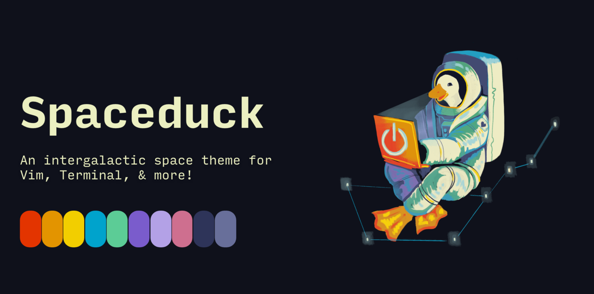
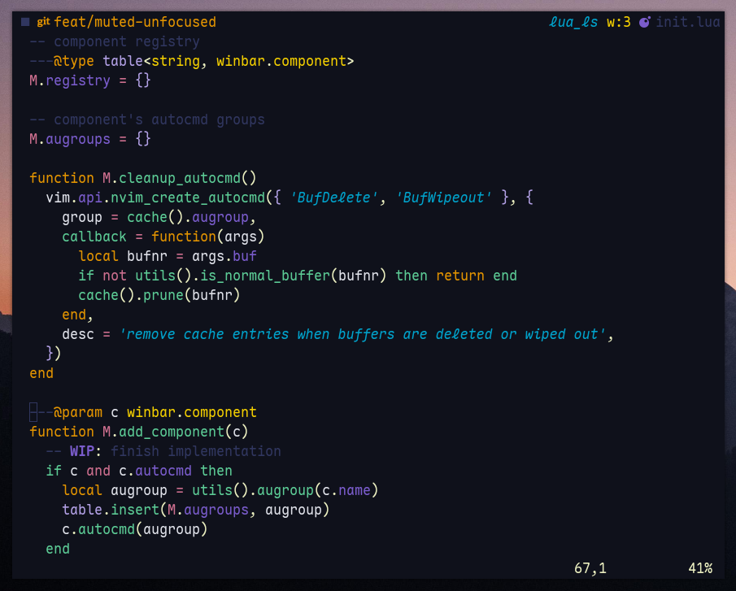
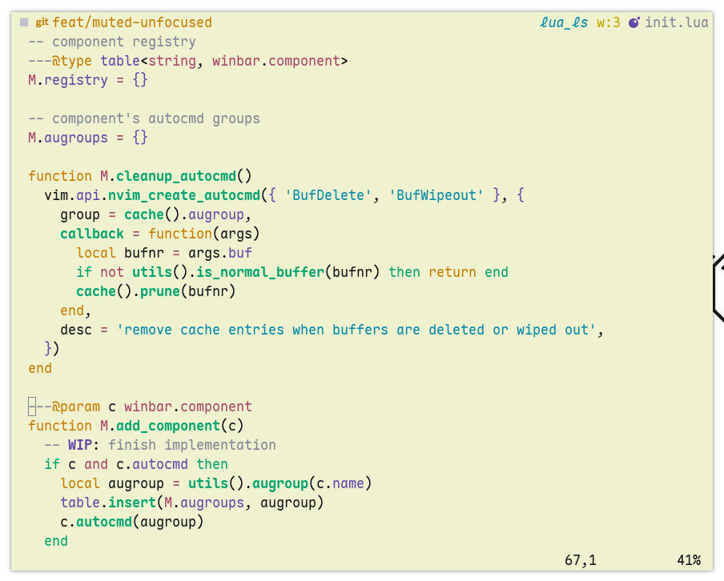

<div align="center">
  <a href="./assets/banner.png" target="_blank">
    
  </a>
</div>

<div align="center">
  <a href="./assets/screenshot-dark.png" target="_blank">
    
  </a>
  <a href="./assets/screenshot-light.png" target="_blank">
    
  </a>
</div>

<div align="center">
  <h1><span style="font-size: 1.2em">🦆</span> spaceduck.nvim</h1>
</div>

<p align="center">
  <strong>~ Spaceduck, always intergalactic ~</strong>
</p>

> [!NOTE]
> Forked from [spaceduck-theme](https://github.com/spaceduck-theme/nvim), this version expands on the original with a `light` theme (WIP) and extra configurations for my personal toolkit.

# Installation

<details>
<summary>With <a href="https://github.com/folke/lazy.nvim">folke/lazy.nvim</a></summary>

```lua
{
    "https://codeberg.org/mateconpizza/spaceduck.nvim",
    config = function()
      vim.o.background = 'light' -- or 'dark'
      vim.cmd.colorscheme('spaceduck')
    end,
    enabled = true,
}
```

</details>

<details>
<summary>With <a href="https://github.com/wbthomason/packer.nvim">packer.nvim</a></summary>

```lua
use({ "spaceduck-theme/nvim", as = "spaceduck" })
```

</details>

# Extras

<details>
<summary>Tools</summary>

| Tool                                                       | Extra                                    |
| ---------------------------------------------------------- | ---------------------------------------- |
| [base16](https://github.com/tinted-theming/home)           | [extras/base16](./extras/base16)         |
| [bat](https://github.com/sharkdp/bat)                      | [extras/bat](./extras/bat)               |
| [delta](https://github.com/dandavison/delta)               | [extras/delta](./extras/delta)           |
| [dunst](https://dunst-project.org/documentation)           | [extras/dunst](./extras/dunst)           |
| [fzf](https://github.com/junegunn/fzf)                     | [extras/fzf](./extras/fzf)               |
| [newsboat](https://newsboat.org/)                          | [extras/newsboat](./extras/newsboat)     |
| [rofi](https://github.com/davatorium/rofi)                 | [extras/rofi](./extras/rofi)             |
| [xresources](https://wiki.archlinux.org/title/X_resources) | [extras/xresources](./extras/xresources) |
| [zathura](https://pwmt.org/projects/zathura/)              | [extras/zathura](./extras/zathura)       |

</details>

# Author's Inspiration

This theme was inspired from my incessant desire to feel like I'm in space when I stare at a computer.
"Spaceduck" takes its name from my love of [duck dodgers](https://m.media-amazon.com/images/M/MV5BNDY2YjgyZGMtMWY2Zi00ZmQ5LTg0YjgtNjYyMGNkMTMzNWU1XkEyXkFqcGdeQXVyMzM4NjcxOTc@._V1_.jpg) as a kid.

- Thank you [Guillermo Rodriguez](https://github.com/pineapplegiant/spaceduck)

# Plugins support

<details>
<summary>With <a href="https://github.com/hoob3rt/lualine.nvim">Lualine</a></summary>

<center>
  
  
  
  
</center>

```lua
require("lualine").setup({
  options = {
    theme = "spaceduck",
  },
})
```

</details>
